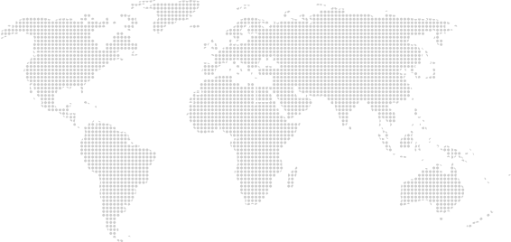

# Handoff: Mapa Mundial com Pins de Escritórios (JMB)

## Overview
Mapa-múndi pontilhado (dotted world map) com 22 pins marcando as localidades do World M&A Alliance, para uso no site institucional da JMB. Fundo transparente. Ao passar o mouse sobre um pin, aparece um tooltip com a cidade e o país.

## Sobre os arquivos deste pacote
Os arquivos aqui são **referências de design feitas em HTML/CSS/JS puro** — mostram exatamente a aparência e o comportamento pretendidos, mas não precisam ser copiados literalmente. A tarefa é **recriar este componente no ambiente/stack já usado no projeto do site da JMB** (React, Vue, WordPress/PHP, etc.), seguindo os padrões que já existem lá. Se o layout do componente (um `<div>` posicionado relativamente, com uma imagem de fundo e pins posicionados em %) já servir como está, ele pode ser adaptado quase 1:1 — é um componente simples, sem lógica de negócio.

## Fidelidade
**Alta fidelidade (hifi)**: cores, posições dos pins e comportamento de hover são finais. As posições dos pins foram calibradas manualmente contra as coordenadas reais do arquivo SVG (não são um chute visual).

## Arquivos deste pacote
- `world-map-base.svg` — o mapa-múndi pontilhado (arquivo de imagem, fundo transparente). É a MESMA arte que o usuário enviou originalmente, sem nenhuma edição.
- `mapa-mundial-reference.html` — versão de referência standalone em HTML/CSS/JS puro (sem framework), abra direto no navegador. É a forma mais fácil de portar para qualquer stack.

## Estrutura / Layout
```html
<div class="map-wrap">          <!-- position:relative; width:100%; max-width:1100px; aspect-ratio:566.4/268.5 -->
     <!-- position:absolute; top:0;left:0; width:100%; height:100% -->
  <div class="map-pin" style="left:X%; top:Y%">   <!-- position:absolute; transform:translate(-50%,-50%) -->
    <div class="map-pin__dot"></div>              <!-- círculo colorido -->
    <div class="map-pin__tooltip">Cidade, País</div>  <!-- aparece só no hover -->
  </div>
  ... (22 pins)
</div>
```
- O container `.map-wrap` usa `aspect-ratio: 566.4 / 268.5` (a proporção exata do viewBox do SVG) — isso é o que garante que as posições em % dos pins caiam sempre no lugar certo, em qualquer largura de tela.
- Cada pin é posicionado com `left`/`top` em **porcentagem** (relativos ao `.map-wrap`), não em pixels — assim o mapa é responsivo.

## Interações & Comportamento
- **Hover no pin** → o círculo aumenta (scale 1.45) e muda para um tom mais claro da cor; o tooltip acima do pin aparece (fade + slide de 4px).
- **z-index**: o pin em hover sobe para `z-index:100` para o tooltip não ficar atrás de pins vizinhos (importante na Europa, onde há 10 pins bem próximos).
- Sem clique/navegação — é só informativo. (Se quiserem que o pin leve para uma página de contato do escritório, é só envolver o pin num `<a>`.)

## Design Tokens
- Cor do pin (padrão): `#1E3A5F` (azul-marinho)
- Cor do pin no hover: `#3E6089` (mesma cor, clareada ~28%)
- Tamanho do pin: `14px` de diâmetro, borda branca de `2px`
- Tooltip: fundo na mesma cor do pin, texto branco `13px/500`, `border-radius:6px`, `padding:5px 10px`
- Fonte: Helvetica/Arial (sem fonte customizada)
- Sombra do pin: `0 1px 3px rgba(0,0,0,0.35)` (repouso) / `0 2px 7px rgba(0,0,0,0.45)` (hover)

No protótipo original (Design Component), cor do pin, tamanho do pin e um modo "mostrar todos os nomes sempre" são configuráveis por props — pode reimplementar isso como props/variáveis do componente se fizer sentido no projeto.

## Localidades e coordenadas dos pins (% de left/top dentro do `.map-wrap`)
Todas as coordenadas foram calibradas contra as coordenadas reais dos pontos do SVG (não são estimativas soltas).

| Cidade | País | left % | top % |
|---|---|---|---|
| Melbourne | Austrália | 88.065 | 87.523 |
| São Paulo | Brasil | 28.884 | 74.860 |
| Londrina-PR | Brasil | 27.295 | 74.860 |
| Paris | França | 44.527 | 20.819 |
| Hamburgo | Alemanha | 47.210 | 20.819 |
| Mumbai | Índia | 66.419 | 46.331 |
| Nova Délhi | Índia | 67.126 | 38.845 |
| Dublin | Irlanda | 40.378 | 18.399 |
| Milão | Itália | 46.504 | 26.853 |
| Tóquio | Japão | 84.834 | 28.343 |
| Cidade do México | México | 14.107 | 46.667 |
| Varsóvia | Polônia | 50.053 | 22.346 |
| Lisboa | Portugal | 40.095 | 28.343 |
| Madrid | Espanha | 41.525 | 29.832 |
| Barcelona | Espanha | 42.320 | 28.343 |
| 's-Hertogenbosch | Holanda | 45.798 | 22.346 |
| Istambul | Turquia | 52.895 | 29.832 |
| Londres | Reino Unido | 41.967 | 19.888 |
| Houston | Estados Unidos | 14.495 | 34.339 |
| San Diego | Estados Unidos | 8.104 | 35.829 |
| Washington | Estados Unidos | 19.721 | 28.492 |
| Nova York | Estados Unidos | 20.498 | 27.523 |

(Essa mesma tabela está embutida como array de dados no topo do `mapa-mundial-reference.html`, pronta pra copiar.)

## Assets
- `world-map-base.svg`: mapa-múndi pontilhado enviado pelo usuário (fonte: Vecteezy, uso livre conforme baixado pelo cliente). Não foi alterado — os pins são elementos separados sobrepostos por cima, não fazem parte do SVG.

## Como aplicar no site
1. Copie `world-map-base.svg` para a pasta de assets/imagens do projeto.
2. Recrie o markup do `.map-wrap` (ver seção "Estrutura / Layout" acima) no componente/página do site, usando os tokens de cor/tamanho acima.
3. Gere os 22 pins a partir da tabela de coordenadas (pode ser um `.map()` em React/Vue, um loop no template do CMS, ou HTML estático — o `mapa-mundial-reference.html` mostra o HTML final já expandido, útil pra copiar/colar).
4. Confirme que o container pai não corta (`overflow:hidden`) o tooltip quando ele aparece acima do pin.
